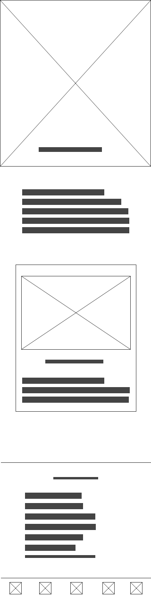

# **Style Guide**

## **Bakgrund och brödtext**

Till en **Primary** bakgrund använder vi text-dark.

## **Layout**

### **Start sida**

Våran layout på på start sida ska innehålla ett grid system med 12 columner. Vi kommer inte använda Bootstraps vi kommer att arbeta i ett 
eget layout system.

### **Info sida**

## **Mobil Layout**

Mobil layouten kommer att ta upp hela skärmen det kommer bara vara en column. 

### **Mobil start sida**

Start sidan kommer att ha stora cards under varandra. 

### **Mobil info sida**

Mobil info sidan ska se likadan som på datorn men mindre och med bilden mellan texten istället för på samma x axeln.

hej hej hej